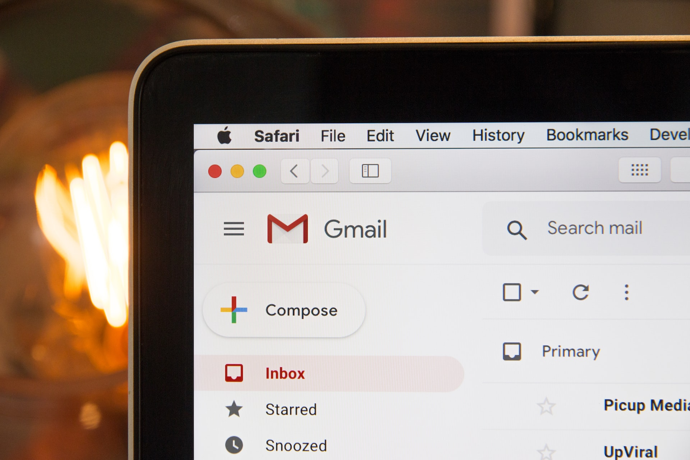

Les emails sont très utilisés de nos jours et possèdent pourtant énormément de défauts.

Vous devriez privilégier les [messageries instantanées](/basiques/instant-messengers) plutôt que les emails.

## Fonctionnement

Le système d'email se base exactement sur le même principe que la poste :

Vous envoyez un courrier à la poste, les facteurs le feront passer dans différents relais avant de l'envoyer à la boîte aux lettres de votre destinataire.

Votre lettre passe donc de votre boîte aux lettres (à une époque, c'est le facteur qui venait chercher votre courrier dans votre boîte aux lettres), ensuite à votre centre postal local, puis il peut être envoyé à un autre centre postal plus général (il peut passer par Paris par exemple), puis au centre postal local de votre destinataire et enfin, à sa boîte aux lettres.

## Les problèmes de sécurité

Les [emails sont transférés en clair sur Internet](https://latacora.micro.blog/2020/02/19/stop-using-encrypted.html), ce qui est un énorme problème. Il faut comprendre que les mails furent créés à une époque où la sécurité n'était absolument pas requise. Au début des années 70, Internet n'était même pas né, c'était son ancêtre ARPANET, aux États-Unis, dans lequel une centaine d'ordinateurs étaient connectés entre eux.

Le protocole [PGP](https://fr.wikipedia.org/wiki/Pretty_Good_Privacy) (Pretty Good Privacy) permet de combler certaines lacunes des mails en chiffrant votre message dans l'email, mais l'objet du message n'est pas chiffré ni ses métadonnées (donc on connaît le sujet du mail, la taille, qui l'envoie, qui le reçoit, à quelle heure, depuis quelle adresse IP, etc.).

***Pour réitérer, le protocole PGP reste un [pansement pour les mails](https://twitter.com/DanielMicay/status/1145264664315604992) mais [ne guérit pas du tout la plaie](https://latacora.micro.blog/2019/07/16/the-pgp-problem.html)***.

**Proton Mail** propose du **PGP par défaut**. Cela ne fonctionne qu'entre utilisateur Proton, et non c'est pas un choix commercial, mais c'est compliqué de **chiffrer** un message si votre destinataire **n'a pas la clé** pour le **déchiffrer** 😉️, c'est pour ça d'ailleurs que tous les utilisateurs de **WhatsApp** doivent communiquer sur **WhatsApp**, que tous les utilisateurs de **Signal** doivent communiquer sur **Signal**, etc.

Vous pouvez évidemment envoyer des mails de **Proton Mail** à **Gmail** (ou autre), mais vos messages ne seront pas chiffrés.

Mais si vous devez communiquer avec quelqu'un, privilégiez toujours des messageries instantanées comme [Signal](/basiques/instant-messengers/#signal).

## Les problèmes écologiques

Les [emails polluent énormément](https://cyberworldcleanupday.fr/fichiers/CWCUD-2022-Guide-5-Nettoyer-ses-e-mails-1.pdf). Ils sont gardés sur les serveurs de votre fournisseur d'email (Gmail, Outlook, Proton, etc.). Ces serveurs ont besoin d'être ventilés à longueur de journée, il est donc primordial de supprimer vos emails inutiles pour laisser la place au stockage "utile". Si en plus vous avez des pièces jointes attachées à vos emails, cela polluera encore plus.

Si vous envoyez un email avec une pièce jointe, en moyenne, on considère que cet email fera 1 Mo, si vous envoyez cet email à 5 personnes, vous envoyez en réalité 5 fois l'email, et donc utilisez 5 Mo de place sur des serveurs !

Supprimez les images dans les signatures (ou quand vous répondez à quelqu'un, vérifiez que tout le texte, les images et les pièces jointes ne sont pas recopiés dans votre réponse), évitez d'attacher des pièces jointes ou alors envoyez-les via une [messagerie instantanée](/basiques/instant-messengers) comme [Signal](/basiques/instant-messengers/#signal) ou via [Send](https://send.vis.ee/), protégées par un mot de passe de préférence, puis donnez le lien et le mot de passe dans l'email.

---

Supprimez vos mails. Merci.

---

## Les services d'aliasing

Un alias dans le cadre des emails, est une adresse mail qui pointe vers une autre adresse mail. Comme une image vaut mieux qu'un long discours :

Une personne peut vous envoyer un mail à `unautremailcool@simplelogin.fr` et votre employeur, par exemple, ne connaissant que votre adresse mail `mon.mail.de.boulot@simplelogin.fr`, peut vous envoyer des mails uniquement à cette adresse. Tous les mails envoyés à ces adresses seront reçus sur votre boîte mail principale `jean.martin@gmail.com`.

Les alias sont très pratiques puisqu'ils vous permettent de protéger votre vraie adresse mail et d'éviter les spams, puisque si un jour vous recevez trop de spams de votre employeur, vous pouvez juste supprimer `mon.mail.de.boulot@simplelogin.fr`.

Imaginons également que vous avez créé ces alias qui pointent tous vers `jean.martin@gmail.com` :

- `réseaux-sociaux@simplelogin.fr`
- `shopping@simplelogin.fr`
- `travail@simplelogin.fr`
- `santé@simplelogin.fr`

Si vous recevez énormément de spams sur `réseaux-sociaux@simplelogin.fr`, vous pouvez supprimer cet alias, en créer un nouveau (avec un nom différent évidemment), et vous n'aurez qu'à changer ce mail sur les quelques services avec lequel vous vous étiez connectés avec cette adresse mail.
En temps normal, vous auriez dû supprimer votre adresse mail principale et modifiez **TOUS** vos comptes liés à cette adresse email.

*Pour savoir quel service d'aliasing utiliser :*

- [Les services d'aliasing](/alternatives/providers/#les-services-daliasing)

## Conclusion

Évitez absolument l'utilisation des emails, ils ont trop de défauts du point de vue de la sécurité, de la vie privée et de l'écologie. Si vous devez quand même ce service, choisissez un fournisseur de confiance. Voici mon article sur les solutions disponibles :

- [Les fournisseurs de mail](/alternatives/providers/#les-mails)

Quant à l'écologie, les mails sont vraiment à bannir. Privilégiez des messageries instantanées telles que Signal, WhatsApp, Discord, Microsoft Teams, Slack ou encore Element (je recommande uniquement Signal).

---

## En savoir plus & crédits

### Écologie

- 🇫🇷️ [CyberWorldCleanUpDay - Guide 5 : Nettoyer ses emails](https://cyberworldcleanupday.fr/fichiers/CWCUD-2022-Guide-5-Nettoyer-ses-e-mails-1.pdf)

### Sécurité

- 🇬🇧️ [Security and Privacy Advice # Email - Madaidan](https://madaidans-insecurities.github.io/security-privacy-advice.html#email)
- 🇬🇧️ [The PGP problem](https://latacora.micro.blog/2019/07/16/the-pgp-problem.html)
- 🇬🇧️ [Issues with PGP - KickSecure](https://www.kicksecure.com/wiki/OpenPGP#Issues_with_PGP)
- 🇬🇧️ [Stop Using Encrypted Email](https://latacora.singles/2020/02/19/stop-using-encrypted.html)
- 🇬🇧️ [tweet de hanno - sur Twitter](https://twitter.com/hanno/status/1145597144373575680)
- 🇬🇧️ [tweet de Daniel Micay (fondateur de GrapheneOS) - sur Twitter](https://twitter.com/DanielMicay/status/1145264664315604992)

### Les solutions

- [Les alternatives 📨️ # Les mails - SimplePrivacy](/alternatives/providers#les-mails)
- [Les alternatives 📨️ # Les services d'aliasing - SimplePrivacy](/alternatives/providers#les-services-daliasing)
