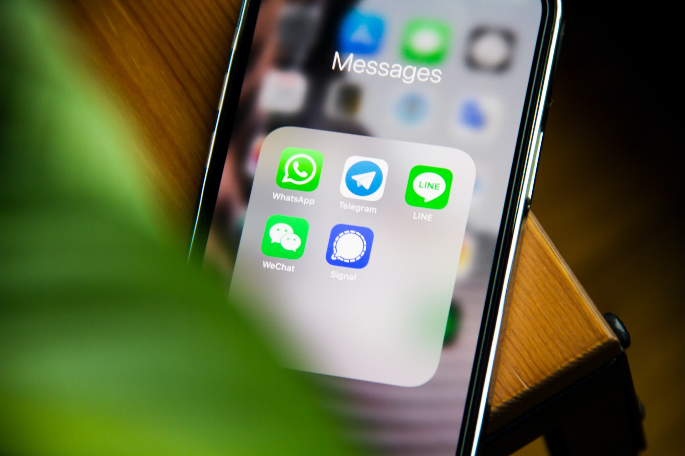
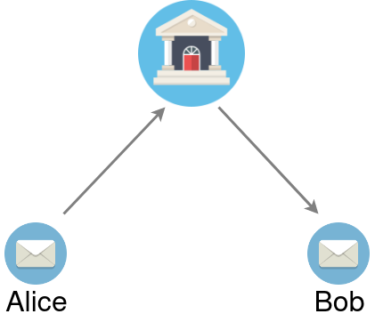
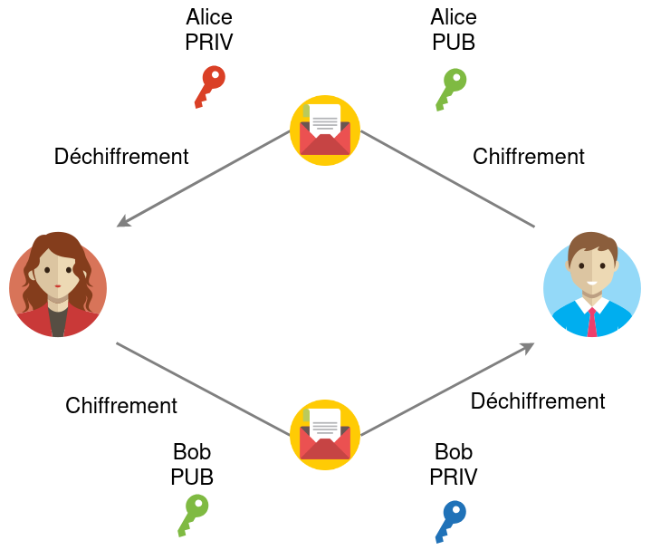
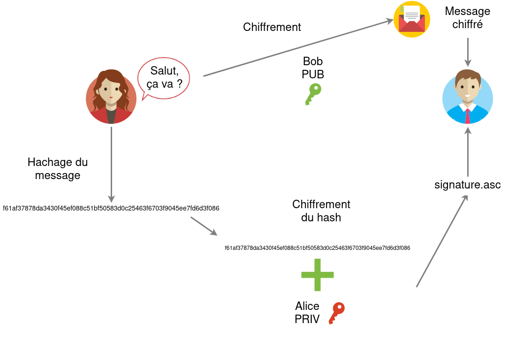
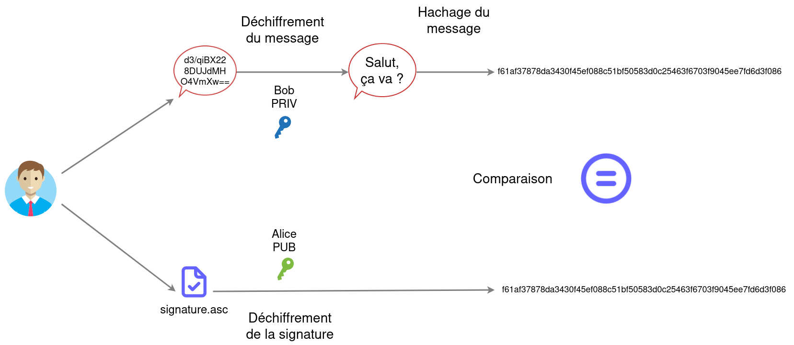
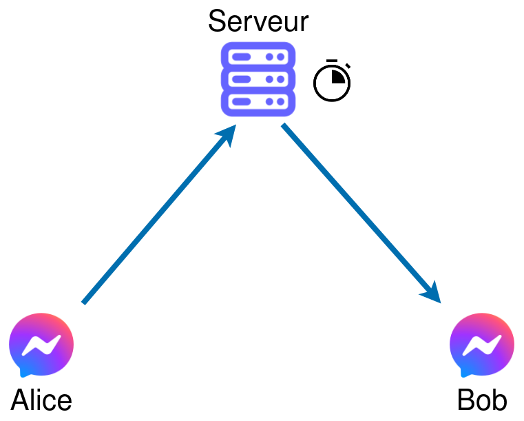
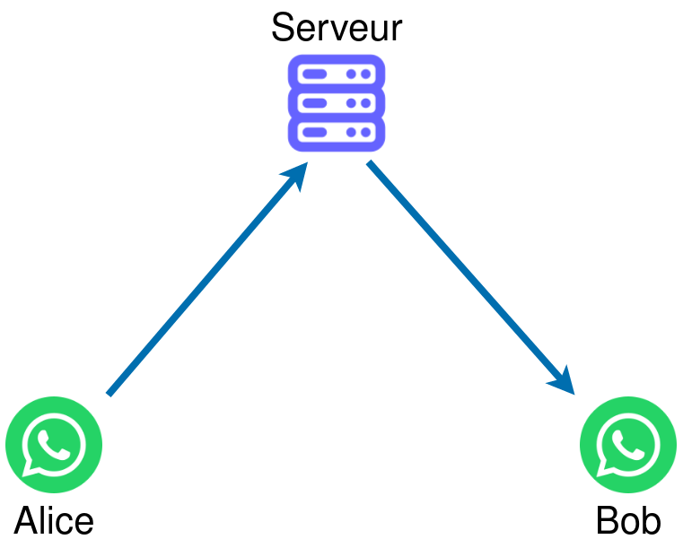

Les messageries instantanées sont des solutions de communication incontournables au 21ème siècle.

Je vais vous en présenter quelques unes. Mais d'abord vous devez comprendre ce qu'est le chiffrement de bout en bout.

## Le chiffrement de bout en bout

Le chiffrement de bout en bout consiste à chiffrer les messages à partir des appareils des utilisateurs, c'est à dire que si vous utilisez votre application sur votre téléphone, le message sera chiffré à partir de votre application de votre téléphone, et sera déchiffré uniquement sur l'application du destinataire, aucun tiers pendant le transit du message n'est capable de savoir le contenu du message.

Pour comprendre, je vais vous expliquer avec un exemple de la poste.

Alice envoie une carte postale à Bob, le service de la poste s'occupera du transfert de cette carte postale.
Le problème dans ce cas, c'est que la carte postale n'est pas dans une enveloppe, elle n'est pas scellée, n'importe qui peut lire ou modifier la carte avant que Bob la réceptionne.

Trois problèmes majeurs se posent :

- **Confidentialité**
- **Intégrité**
- **Authenticité**

Tout le monde peut lire le message, Alice, Bob, et toute autre personne a accès à cette carte postale. La ***confidentialité*** n'est pas assurée car seuls Alice et Bob devraient avoir connaissance du message.

Bob ne peut pas vérifier que le message de la carte postale est ***intègre***. C'est à dire qu'on ne peut pas garantir que le message n'a pas été modifié par une tierce personne pendant le transit de la carte.

Bob ne peut pas vérifier l'***authenticité*** de la carte car on ne peut pas être certain que c'est bien Alice qui a envoyé le message, et non une tierce personne.

---

Ces trois problèmes peuvent cependant être réglés facilement.

---

- Pour la **confidentialité** du message, Alice peut chiffrer son message grâce à un code secret déjà établi entre Alice et Bob. Si une tierce personne lisait la carte postale d'Alice, cette personne ne comprendrait rien ! Seuls Alice et Bob se comprendraient !
- Pour l'**intégrité** de la carte, Alice peut tracer deux petits traits à l'arrière de l'enveloppe. Quand Bob recevra l'enveloppe, si les traits sont bien alignés, c'est que l'enveloppe n'a pas été ouverte et donc que le message est intègre.
- Pour l'**authenticité**, Alice peut signer sa carte postale, ou au dos de l'enveloppe pour prouver que c'est bien elle qui a écrit le message.

### Fonctionnement du chiffrement

Le principe du chiffrement de bout en bout repose sur le chiffrement dit **asymétrique**.

Le principe repose sur la génération d'une **paire de clés**, une clé **publique** et une clé **privée**. Alice va générer sa paire de clé, donc une clé publique (en vert) et une clé privée (en rouge). Bob fera de même en générant sa clé publique (en vert) et sa clé privée (en bleu). Dites-vous que ces deux clés (publique et privée) sont comme des faux jumeaux, elles sont intimement liées, mais ne se ressemblent pas.

La clé **publique** est, comme son nom l'indique, publique. Vous pouvez la donner à vos amis, à votre famille, sur Internet, sur les réseaux sociaux, etc. C'est la clé qui permettra aux autres de ***chiffrer*** les messages qui vous sont destinés (puisque la clé publique est reliée à votre clé privée, donc vous).

La clé **privée** est, comme son nom l'indique, privée. Vous devez ***absolument*** garder cette clé pour vous, vous ne devez pas la partager ! C'est la clé qui permettra de ***déchiffrer*** les messages qui vous sont destinés (puisque les gens auront chiffré leur message avec votre clé publique).

Si **Bob** veut envoyer un message à Alice, Bob doit avoir la clé publique **d'Alice** (`Alice PUB` dans l'image) pour pouvoir communiquer avec elle. Bob va donc **chiffrer** son message avec la **clé publique d'Alice**, puis une fois envoyé, Alice **déchiffrera** le message avec sa **clé privée à elle** (`Alice PRIV` dans l'image).

Si Alice envoyait un message à Bob, Alice devrait se procurer la **clé publique de Bob** pour pouvoir chiffrer son message, puis Bob déchiffrerait le message avec sa **clé privée à lui**.

Une conversation normale ressemblerait donc à ça :

Les messageries instantanées (certaines) implémentent donc le chiffrement de bout en bout pour assurer la **confidentialité** des messages. Mais les clés privées permettent également de garantir l'[authenticité](#la-signature-digitale) des messages !

---

Le **chiffrement** garantit la **confidentialité**. *Le message est lisible uniquement par Alice et Bob.*

---

Je vous envoie sur les sites de la [CNIL](https://www.cnil.fr/fr/) pour en savoir plus, deux articles sont disponibles :

- [Sécurité : Chiffrer, garantir l’intégrité ou signer - CNIL](https://www.cnil.fr/fr/securite-chiffrer-garantir-lintegrite-ou-signer)
- [Comprendre les grands principes de la cryptologie et du chiffrement- CNIL](https://www.cnil.fr/fr/comprendre-les-grands-principes-de-la-cryptologie-et-du-chiffrement) (je vous conseille fortement de lire cet article, il est complet et facile à comprendre)

### Le hachage

Le **hachage** est un procédé informatique par lequel on hache une donnée (un fichier, un message, etc.), de la même manière qu'un steak haché par exemple. On a donc ensuite le **fichier d'origine** et le **fichier haché**, qui est l'empreinte digitale numérique du fichier d'origine. Plusieurs algorithmes de hachage existent, voici le hash du mot `France` avec plusieurs algorithmes de hachage différents :

- **MD5 :** `0309a6c666a7a803fdb9db95de71cf01`
- **SHA1 :** `e3772ac4b4db87b4a8dbfa59ef43cd1a8ad29515`
- **SHA256 :** `7a1ca4ef7515f7276bae7230545829c27810c9d9e98ab2c06066bee6270d5153`

Si vous changez `France` en `france`, vous obtenez des résultats complètement différents :

- **MD5 :** `e165d4f2174b66a7d1a95cb204d296eb`
- **SHA1 :** `23e591e8c36dda987970603ad0fdd031b7dff9f9`
- **SHA256 :** `2c598436e5575a5769b69986014588d52c2698414b623e81b2e776766c30eaba`

Même si quelque chose de minime est changé, le **hash** (le résultat du hachage, aussi appelé **condensé** en français) sera complètement différent. Donc, si Alice chiffre son message puis le hache, elle enverra son message et le hash à Bob, et Bob n'aura plus qu'à lui aussi hacher le message et vérifier que c'est le même résultat que le hash envoyé par Alice. Si c'est le cas, le message n'a pas été modifié, sinon, Alice doit renvoyer son message (avec le hash).

> Je précise tout de même que le hash d'un fichier sera toujours le même, sauf si vous changez ce fichier.

---

Le **hachage** garantit l'**intégrité**. *Le message n'a pas été corrompu ou modifié par un tiers.*

---

### La signature digitale

La **signature** permet de prouver qui est l'expéditeur d'un message.

*La signature est un **hash** qui a été **chiffré** avec une **clé privée**.*

Dans le cas des signatures, les clés privées servent à **chiffrer**, et les clés publiques servent à **déchiffrer**.

En effet, dans le cas des **messages**, Alice doit être la seule à pouvoir **déchiffrer** ses messages (grâce à une **clé privée**), mais tout le monde doit être en mesure de **chiffrer** un message pour lui envoyer (grâce à une **clé publique**).

Alors que dans le cas des **signatures**, on veut être en mesure que tout le monde puisse **déchiffrer** la signature (grâce à la **clé publique**) afin de vérifier le hash, mais Alice doit être la seule personne à pouvoir **chiffrer** ce hash (grâce à la **clé privée**), car c'est ce qui permet de prouver que c'est bien elle qui a signé ce message. Car rappelez-vous, ***la clé privée reste privée !***

> Si par malheur une personne volait **la clé privée d'Alice**, il serait en mesure de **déchiffrer** les messages d'Alice, mais également de faire croire que c'est bien Alice l'**expéditrice** du message !

1. Alice souhaite envoyer un message à Bob, elle va hacher son message et chiffrer ce hash avec **sa clé privée à elle**, cela donnera une signature. Elle utilisera ensuite **la clé publique de Bob** pour **chiffrer** son message. Elle envoie donc deux fichiers à Bob, le **message chiffré** et la **signature**.

    

2. Bob va donc recevoir ces deux fichiers, il déchiffrera le message d'Alice grâce à **sa clé privée à lui**. Mais afin de s'assurer que le message a bien été envoyé par Alice, il va déchiffrer la signature avec **la clé publique d'Alice**, il obtiendra donc le hash initial du message. Bob n'a plus qu'à hacher le message reçu d'Alice et comparer ce hash avec celui envoyé par Alice.

---

La **signature digitale** garantit à la fois l'**authenticité** et l'**intégrité**. *Le message provient bien d'Alice (clé privée d'Alice) et il n'a pas été corrompu ou modifié par un tiers  (hash du message).*

---

Une vidéo en anglais est disponible sur YouTube pour comprendre la signature digitale :

- [What are Digital Signatures? - Computerphile](https://www.youtube-nocookie.com/embed/s22eJ1eVLTU)

## On dit chiffrer, et pas crypter

Tant qu'on y est, "crypter" n'est pas français.

- **Chiffrement** : chiffrer un message **grâce** à une clé.
- **Déchiffrer** : déchiffrer un message **grâce** à une clé.
- **Décrypter** : déchiffrer un message **sans** la clé (un hacker qui essayerait de découvrir le contenu du message par exemple).
- **Crypter** : chiffrer un message **sans** la clé (bon courage !).

Je vous envoie sur ce site très bien fait qui explique les différences entre les termes :

- [On dit chiffrer, et pas crypter - Max](https://chiffrer.info/)

---

Maintenant que vous avez compris ces notions, je vais vous présenter différentes messageries instantanées.

---

## SMS

J'en profite pour vous dire que vous devriez éviter un maximum les SMS, c'est probablement la technologie [la moins sécurisée](https://secure-voice.com/ss7_attacks/) en terme de moyen de communication. Les [SMS ne sont pas chiffrés](https://proton.me/blog/stop-using-sms) et peuvent être lisible par n'importe qui. Votre FAI (Fournisseur d'Accès à Internet : Orange, Free etc.) ou un hacker peut lire tous vos SMS, et les revendre à des tiers ou les donner au gouvernement.

Par ailleurs, n'importe qui peut faire croire qu'il est l'auteur du message, et n'importe qui peut faire croire qu'il est le destinataire du message. Le [phishing](https://www.bejarano.io/sms-phishing/) est très présent sur les SMS, faites attention, car ils peuvent paraître légitimes et pourtant être frauduleux.

Si vous ne pouvez pas vous passer des SMS, je vous conseille fortement d'utiliser [Google Messages](https://play.google.com/store/apps/details?id=com.google.android.apps.messaging) qui implémente du [chiffrement de bout en bout](https://www.gstatic.com/messages/papers/messages_e2ee.pdf) (grâce au **Signal Protocol**) pour ses utilisateurs (c'est à dire que comme pour toute application, l'autre personne doit également avoir Google Messages). Pour profiter de cette [fonctionnalité](https://support.google.com/messages/answer/10262381?hl=fr), vous devez aller dans les paramètres de Google Messages et activer les "[fonctionnalités de chats](https://support.google.com/messages/answer/7189714?hl=fr&ref_topic=9459217)", si votre interlocuteur a également activé les fonctionnalités de chat, votre conversation sera automatiquement chiffré de bout en bout (normalement, c'est **activé par défaut**).

---

Partez du principe que quand vous envoyez un SMS, il peut être lu ***par n'importe qui !*** Si possible, évitez absolument son utilisation.

---

## Facebook Messenger

[Facebook Messenger](https://www.messenger.com/?locale=fr_FR) fonctionne de cette manière :

Quand Alice envoie un message à Bob, l'application Messenger envoie le message **en clair** aux serveurs de Facebook. Ce message reste stocké **en clair** sur ce serveur. L'application Messenger de Bob va demander au serveur de voir le message, le serveur lui envoie une copie de ce message, et Bob sera en mesure de lire le message d'Alice.
Le message d'Alice est toujours sur le serveur.

Le problème est que sur Facebook Messenger, les messages ne sont pas chiffrés de bout en bout, et sont donc visibles par Facebook puisque les messages restent stockés en clair sur leurs serveurs. C'est une gigantesque intrusion à votre vie privée, et cela revient à la même chose que si vous étiez à la terrasse d'un café avec l'un de vos amis, et qu'au lieu de parler tranquillement, vous discutiez en hurlant.

Ce n'est pas nouveau, Facebook Messenger a toujours été capable de lire vos messages, et on nous l'a [encore prouvé](https://www.lemonde.fr/pixels/article/2022/08/11/avortement-illegal-aux-etats-unis-facebook-critique-pour-avoir-fourni-a-la-justice-des-messages-prives_6137767_4408996.html) en août 2022.

Une fonctionnalité appelée "[conversation secrète](https://www.facebook.com/help/1084673321594605/?locale=fr_FR)" (qui au passage, [utilise le "**Signal Protocol**"](https://about.fb.com/wp-content/uploads/2016/07/messenger-secret-conversations-technical-whitepaper.pdf#page=4)) est disponible sur Facebook. Cependant, Facebook collecte massivement vos métadonnées de cette "conversation secrète" (de la même manière que [WhatsApp](#whatsapp)) car le **Signal Protocol** ne garantit que la confidentialité (l'authenticité et l'intégrité évidemment) des messages et non des métadonnées.

Je vous conseille quand même d'utiliser cette conversation secrète le temps que vous changiez pour [Signal](#signal).

*Le même problème s'applique pour Instagram, vous devez manuellement [activer le chiffrement de bout en bout](https://help.instagram.com/1165835007222763) dans les paramètres de votre conversation. Sauf que... ce n'est pas encore possible de l'activer en France de ce que j'ai pu constater... Pour faire simple, vos messages sont en clair sur Instagram, et il n'y a rien que vous puissiez faire.*

---

Arrêtez de converser via Facebook Messenger et Instagram. Merci.

---

## WhatsApp

[WhatsApp](https://www.whatsapp.com/?lang=fr) fonctionne autrement :

Quand Alice souhaite envoyer un message à Bob, le message sera **chiffré** puis envoyé aux serveurs de WhatsApp. Les serveurs ne servent qu'à délivrer le message. Les messages restent stockés sur les serveurs uniquement le temps de la livraison du message. Une fois que Bob à reçu le message, il est supprimé du serveur et les messages restent stockés sur les appareils d'Alice et Bob.

Une [surface d'attaque](https://fr.wikipedia.org/wiki/Surface_d%27attaque) présente sur WhatsApp est le fait que les images et les vidéos sont automatiquement enregistrées sur l'appareil. Jeff Bezos (le PDG d'Amazon) [s'est fait piraté](https://www.theguardian.com/technology/2020/jan/21/amazon-boss-jeff-bezoss-phone-hacked-by-saudi-crown-prince) de cette manière. Je vous conseille de **désactiver** cette fonctionnalité.

> WhatsApp utilise le "[Signal Protocol](https://www.whatsapp.com/security/WhatsApp-Security-Whitepaper.pdf)". Cependant, le "Signal Protocol" ne garantit pas que les **métadonnées** soient chiffrées.

### Métadonnées

Sur WhatsApp, les métadonnées ne sont pas chiffrées, et donc visibles par WhatsApp (et donc Facebook), telles que :

- quand vous êtes en ligne
- quand vous écrivez, et à qui
- combien de temps vous écrivez, et à qui
- combien de mots vous écrivez, et à qui
- si vous utilisez WhatsApp sur téléphone ou sur PC
- et d'où (localisation)

De plus comme WhatsApp est relié à Facebook, Facebook connaît donc également :

- tous vos contacts et leur numéro de téléphone
- vos interactions avec des produits et vos informations publicitaires
- votre identité, l'identité de l'appareil
- votre adresse IP

Comme dirait [Edward Snowden](https://twitter.com/Snowden/status/661305566967562240) :

> Vous avez du mal à comprendre le terme "métadonnées" ? Remplacez-le avec le terme "Historique d'activité", parce que c'est ce que sont les métadonnées.

Ces métadonnées sont [collectées par WhatsApp](https://www.lemonde.fr/pixels/article/2021/01/07/whatsapp-revoit-ses-conditions-d-utilisation-sur-le-partage-des-donnees-utilisateurs-avec-facebook_6065529_4408996.html) et [partagées avec Facebook](https://arstechnica.com/tech-policy/2021/01/whatsapp-users-must-share-their-data-with-facebook-or-stop-using-the-app/).

Les métadonnées sont [aussi importantes que les données](https://ssd.eff.org/fr/module/voici-pourquoi-les-m%C3%A9tadonn%C3%A9es-sont-importantes).

> "Ils savent que vous avez reçu le courriel d’un service de test du VIH, que vous avez ensuite appelé votre docteur, puis visité le site Web d’un groupe de soutien pour les personnes atteintes du VIH, dans la même heure. Mais ils ne savent pas le contenu du courriel ni de quoi vous avez parlé au téléphone."

Même si vos messages sur WhatsApp sont chiffrés, on n'a pas besoin de connaître le contenu des messages pour connaître votre vie.

En archéologie par exemple, on peut deviner l'utilité d'un objet grâce aux métadonnées : la composition de l'objet, à quelle date tel métal était utilisé, le type d'objet, etc. Donc oui les métadonnées ne sont pas anodines.

### Sauvegardes WhatsApp

Que vous soyez sur Android ou iOS, WhatsApp vous propose de sauvegarder vos messages, fonctionnalité fort pratique mais qui a pour inconvénient de [sauvegarder également la clé](https://sudneela.github.io/posts/the-workings-of-whatsapps-end-to-end-encrypted-backups/) qui permet de déchiffrer vos messages. Pour faire simple, vos messages peuvent être déchiffrés dans le cloud, et sont donc par extension lisible par votre fournisseur cloud (Google Drive ou iCloud).

Vous pouvez tout de même profiter de cette fonctionnalité en [activant la sauvegarde chiffrée de bout en bout](https://faq.whatsapp.com/629089898272226/). Je vous conseille de générer une clé de chiffrement à 64 chiffres comme le propose WhatsApp et de le sauvegarder dans votre [gestionnaire de mots de passe préféré](/fiches/bitwarden). Si vous oubliez ce mot de passe, il n'y a évidemment aucun moyen de récupérer vos messages, inscrivez-le dans un gestionnaire de mots de passe ! Je ne le dirais jamais assez !

Cela dit, comme la sauvegarde chiffrée est optionnelle, ça veut dire que même si vous activez cette fonctionnalité, si vous discutez avec une personne qui a activé la sauvegarde automatique (**non** chiffrée), tous ses messages et sa clé de déchiffrement seront enregistrés dans le cloud, cela inclut donc vos messages... La sauvegarde chiffrée de bout en bout est donc inutile puisqu'elle est optionnelle (sauf si le destinataire a également activé la sauvegarde chiffrée chiffrement de bout en bout).

## Telegram

[Telegram](https://telegram.org/) ne [propose pas](https://telegram.org/faq#q-pourquoi-ne-pas-simplement-rendre-tous-les-echanges-secrets) de chiffrement de bout en bout par défaut (comme Facebook Messenger). Les messages restent en clair sur leurs serveurs et sont donc visibles par Telegram.

De plus, Telegram utilise son propre protocole qui n'a pas été audité. Telegram est le seul à l'utiliser, ce protocole est propriétaire, on n'a donc aucune idée de ce qu'il fait.

Des experts en sécurité ont trouvé [plusieurs failles](https://portswigger.net/daily-swig/multiple-encryption-flaws-uncovered-in-telegram-messaging-protocol) au protocole de Telegram.
Un [chapitre en anglais](https://madaidans-insecurities.github.io/messengers.html#telegram) a déjà été écris concernant les problèmes de Telegram.

---

Arrêtez d'utiliser Telegram, c'est pire que Facebook Messenger.

---

## Wire

[Wire](https://wire.com/en/) est [open source](https://github.com/wireapp) et a été [audité](https://wire.com/en/blog/application-level-security-audits/). Cependant toutes les métadonnées restent en clair sur leurs serveurs. Ce qui est encore un problème majeur.

## Signal

[Signal](https://www.signal.org/fr/#signal) est l'application par excellence, elle est utilisée par [Edward Snowden](https://mobile.twitter.com/Snowden/status/661313394906161152), les [métadonnées sont protégées](https://signal.org/blog/sealed-sender/). Les [seules métadonnées](https://signal.org/bigbrother/eastern-virginia-grand-jury/) que Signal possède d'un utilisateur sont la date et l'heure de création du compte et la dernière fois qu'il s'est connecté sur leurs services. Oui, c'est rien. Et leur [protocole](https://www.signal.org/docs/) ("**The Signal Protocol**") est un standard de nos jours (la preuve est que [WhatsApp](https://www.whatsapp.com/security/WhatsApp-Security-Whitepaper.pdf) et [Facebook Messenger l'utilisent](https://about.fb.com/wp-content/uploads/2016/07/messenger-secret-conversations-technical-whitepaper.pdf#page=4) depuis des années).

Signal est [open-source](https://github.com/signalapp) et a été [audité](https://eprint.iacr.org/2016/1013.pdf).

Beaucoup d'experts en sécurité ont toujours recommandé Signal.

Depuis [Février 2024](https://www.signal.org/blog/phone-number-privacy-usernames/), une fonctionnalité attendue depuis plusieurs années a enfin été ajoutée, il s'agit des "usernames", c'est un nom d'utilisateur que vous choisissez suivi de deux chiffres que vous pouvez également choisir (`axolotl.99` par exemple). Vous vous créez toujours un compte avec un numéro de téléphone, mais maintenant, vous pouvez partager ce nom d'utilisateur que vous aurez choisi via un line ou un QR code à la place de votre numéro de téléphone, et le plus important, une fois que vous avez partagé ce nom d'utilisateur, la personne ne verra en aucun cas votre numéro de téléphone (si vous avez bien paramétré sur "**Personne**" dans "**Confidentialité > Numéro de téléphone**")

Je ne suis pas un expert, mais je vous recommande Signal également, en plus c'est super simple à utiliser, vous avez autant de fonctionnalités que WhatsApp, voire plus.

### Comment convaincre votre entourage d'utiliser Signal

Une [personne sur Internet](https://www.reddit.com/r/signal/comments/kwovyz/whatsapp_status_to_convince_your_family_friends/) a eu la gentillesse de créer un petit diaporama que vous pouvez mettre sur votre status WhatsApp pour que puissiez convaincre votre entourage d'utiliser Signal au lieu de WhatsApp (vous pouvez aussi juste partager ce diaporama directement par message via [ce lien](https://imgbox.com/g/5Po0sskqve)).

Pour ce faire, allez sur **WhatsApp** :

- Allez dans vos paramètres de confidentialité, et vérifiez que le status WhatsApp soit visible par tout le monde.
- Téléchargez le [fichier zip](FR+(EU).zip) sur votre téléphone.
- Allez dans le dossier décompressé et sélectionnez dans l'ordre les images une par une.
- Une fois que vous les avez toutes sélectionné, cliquez sur le bouton **Partagez**.
- Partagez-les via WhatsApp, puis choisissez "Status".
- Ajoutez votre propre texte sur la diapositive numéro 1.
- Cliquez sur "**Envoyez**".

## Conclusion

Utilisez [Signal](https://www.signal.org/fr/#signal). Le "[Signal Protocol](https://www.signal.org/docs/)" garantit **authenticité**, **intégrité** et **confidentialité**. J'ai écris un [guide d'utilisation](/fiches/signal) pour ceux qui veulent.

*Je tiens à préciser que le "Signal Protocol" a bien été créé par Signal.*

Si vous souhaitez une liste bête et méchante :

> Cette liste a pour unique but de bien vous situer entre les différentes applications, Signal est dans tous les cas, l'application à privilégier.

**Le meilleur :**

1. [Signal](https://www.signal.org/fr/) car chiffrement de bout en bout (Signal Protocol) + protection des métadonnées, le tout par défaut.

    > Signal devrait être votre choix par défaut si vous souhaitez communiquer avec votre entourage. Même si vous utilisez actuellement WhatsApp, je vous conseille quand même de passer à Signal.

**La moyenne :**

2. [WhatsApp](https://www.whatsapp.com/) car chiffrement de bout en bout (Signal Protocol) par défaut.
3. [Wire](https://wire.com/en/) car chiffrement de bout en bout ([dérivée du Signal Protocol](https://wire.com/en/resources/whitepapers/security/5/)) par défaut.

**Les contestés :**

4. [Facebook Messenger](https://www.messenger.com/), chiffrement de bout en bout optionnel (Signal Protocol) et non par défaut.

**À éviter :**

- Telegram, chiffrement de bout en bout optionnel, mais le protocole de chiffrement utilisé est débattu.
- Instagram, pas de chiffrement de bout en bout, pas en France de ce que j'ai pu constater.

---

## En savoir plus & crédits

### Sur la cryptographie (authenticité, intégrité, confidentialité)

- 🇫🇷️ [Sécurité : Chiffrer, garantir l’intégrité ou signer - CNIL](https://www.cnil.fr/fr/securite-chiffrer-garantir-lintegrite-ou-signer)
- 🇫🇷️ [Comprendre les grands principes de la cryptologie et du chiffrement- CNIL](https://www.cnil.fr/fr/comprendre-les-grands-principes-de-la-cryptologie-et-du-chiffrement)
- 🇫🇷️ [On dit chiffrer, et pas crypter - Max](https://chiffrer.info/)
- 🇬🇧️ [End to End Encryption (E2EE) - Computerphile](https://www.youtube-nocookie.com/embed/jkV1KEJGKRA)
- 🇬🇧️ [Secret Key Exchange (Diffie-Hellman) - Computerphile](https://www.youtube-nocookie.com/embed/NmM9HA2MQGI)
- 🇬🇧️ [Double Ratchet Messaging Encryption - Computerphile](https://www.youtube-nocookie.com/embed/9sO2qdTci-s)
- 🇬🇧️ [What are Digital Signatures? - Computerphile](https://www.youtube-nocookie.com/embed/s22eJ1eVLTU)

### Sur les messageries instantanées

- 🇬🇧️ [How Signal Instant Messaging Protocol Works (& WhatsApp etc) - Computerphile](https://www.youtube-nocookie.com/embed/DXv1boalsDI)
- 🇬🇧️ [What's Up With Group Messaging? - Computerphile](https://www.youtube-nocookie.com/embed/Q0_lcKrUdWg)
- 🇬🇧️ [Messengers - Madaidan](https://madaidans-insecurities.github.io/messengers.html)
- 🇬🇧️ [Best Secure Messaging App | FBI Document Leaked - Side of Burritos](https://www.youtube-nocookie.com/embed/wj-aR96FOA0)
- 🇬🇧️ [Never will I ever recommend Telegram again - Simon](https://tgrush.bearblog.dev/never-will-i-ever-recommend-telegram-again/)
- [Les alternatives 📚️ # Les messageries instantanées - SimplePrivacy](/alternatives/apps/#les-messageries-instantanées)

### Sur les métadonnées

- 🇫🇷️ [Voici pourquoi les métadonnées sont importantes - EFF](https://ssd.eff.org/fr/module/voici-pourquoi-les-m%C3%A9tadonn%C3%A9es-sont-importantes)
