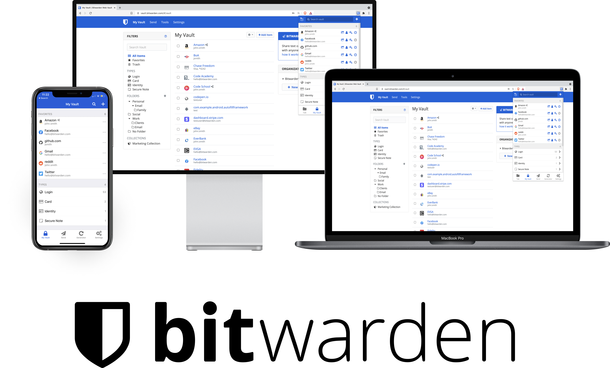

[Bitwarden](https://bitwarden.com/) est un gestionnaire de mots de passe open source, gratuit et facile.

*J'ai écris un article sur les [gestionnaires de mots de passe](/basiques/password-managers) si vous voulez en savoir plus.*

Grâce au gestionnaire de mots de passe, vous n'aurez plus qu'un seul mot de passe à retenir, celui pour accéder au gestionnaire : le `mot de passe maître`.

Aujourd'hui, je vous explique comment utiliser Bitwarden.

## Création de votre compte

Allez sur le site de [Bitwarden](https://bitwarden.com/) et cliquez sur le bouton **Get Started** :

Vous arriverez sur cette page où vous créerez votre compte :

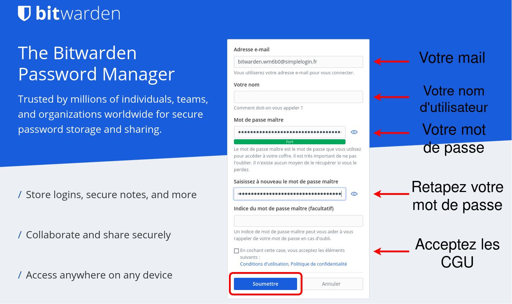

Remplissez les cases comme montré ci-dessus, créez un mot de passe robuste tel que je l'ai expliqué dans mon autre [article](/basiques/password-managers/#la-méthode-diceware) (faites-le, vraiment). ***Ce sera le seul mot de passe que vous aurez à retenir, donc créez un vrai mot de passe robuste.*** Vous pouvez ensuite cliquer sur le bouton **Soumettre** une fois que vous avez tout rempli, ce qui aura comme effet de vous envoyer à la **page de connexion** de Bitwarden comme ci-dessous :

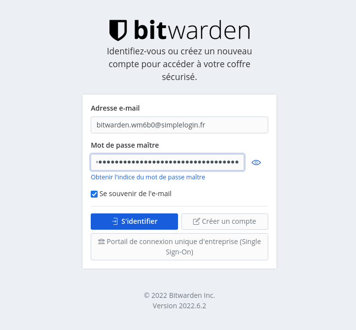

Vous entrez votre nom d'utilisateur et votre mot de passe maître et tada !

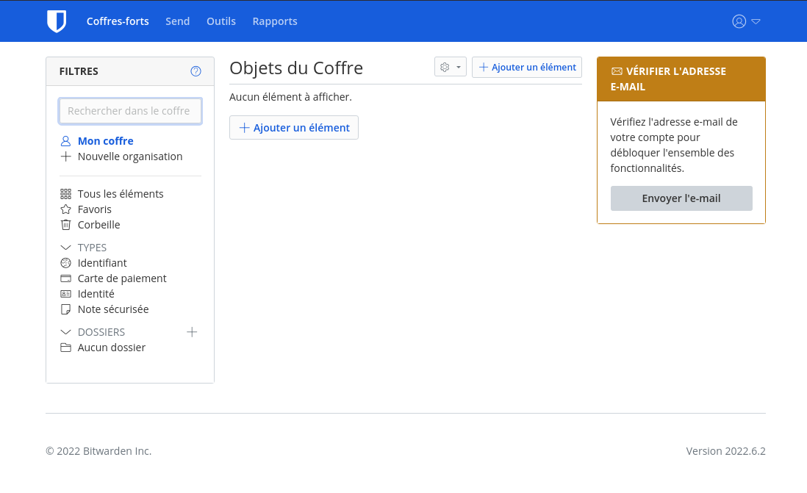

## L'interface

L'interface de bitwarden n'est pas très compliquée, mais je vais vous montrer comment [ajouter vos mots de passe](#ajouter-lextension-à-votre-navigateur) sur l'extension du navigateur juste après ! Ici je vous présente juste l'interface web, mais vous n'y serez pas souvent.

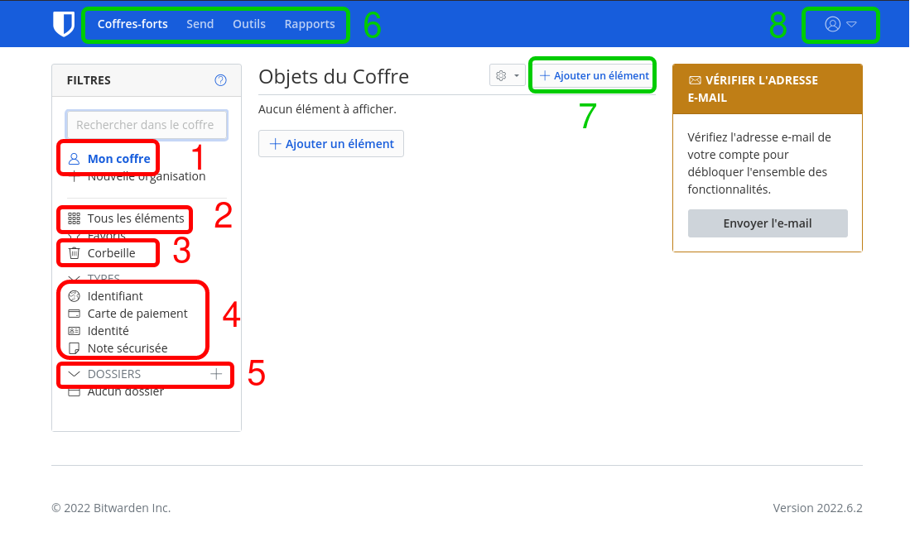

**En rouge :**

1. C'est la page d'accueil de vos mots de passe, de vos notes sécurisées et de vos cartes bancaires. C'est ici que vous verrez absolument tout.
2. C'est la même chose que la page d'accueil.
3. Si vous supprimez des identifiants, ils finiront à la poubelle.  C'est supprimé automatiquement au bout de 30 jours !
4. - Identifiants : Vos identifiants de connexions
	- Carte de paiement : Vos cartes bancaires
	- Identité : Vos cartes d'identités (carte vitale, permis de conduire, etc.).
	- Note Sécurisée : Vos notes sécurisées (très utile pour juste noter des codes PIN, comme ceux des cartes bancaires, ou des cartes de magasins !)
5. Ce sont les dossiers que vous créez pour organiser vos mots de passe, mais c'est optionnel.

**En vert :**

6. - Coffres-forts : Votre coffre, là où vous êtes actuellement, ce sont tous vos éléments.
	- Send : Si vous souhaitez envoyer des fichiers (max : 1Go) à des amis (uniquement avec la version Premium, c'est 10€/an). Cependant, vous pouvez envoyer du texte à un ami avec la version gratuite.
	- Outils : C'est ici que vous trouverez notamment le générateur de mots de passe
	- Rapports : Ce sont des options premium (c'est pas essentiel, ne vous inquiétez pas)
7. Ajouter un élément : Vous cliquez dessus pour ajouter vos identifiants
8. Ce sont vos paramètres de compte

## Importez/Exportez vos mots de passe

*Cette étape est utile pour ceux qui possèdent un autre gestionnaire de mots de passe et souhaitent changer pour Bitwarden, vous pouvez exporter vos mots de passe de votre gestionnaire actuel pour l'importer sur Bitwarden.*

L'avantage avec les gestionnaires de mots de passe, c'est que si vous souhaitez changer, ça prend à peine 5 minutes !
Vous exportez vos mots de passe, vous les importez dans le nouveau, vous supprimez votre compte de votre ancien gestionnaire de mots de passe et c'est réglé !

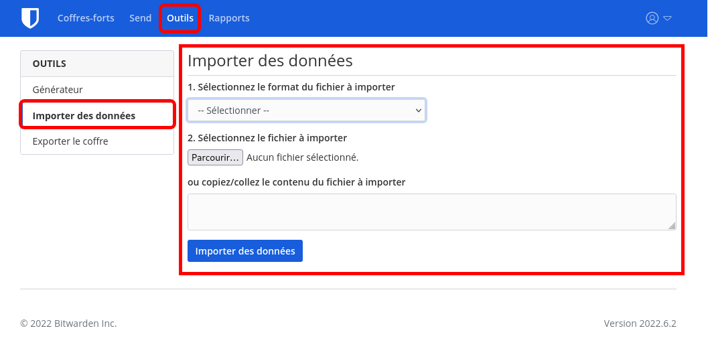

Vous choisissez dans le menu déroulant de quel gestionnaire de mots de passe vous souhaitez importer vos données, vous cliquez sur **Parcourir** et choisissez le fichier importé.

Pour exporter vos mots de passe, allez dans **Exporter le coffre**, le processus est tout aussi simple.

## Ajouter l'extension à votre navigateur

***C'est dans ce chapitre que vous allez pouvoir ajouter vos mots de passe !***

Allez sur sur la [page de téléchargement](https://bitwarden.com/download/) de Bitwarden et cliquez le navigateur sur lequel vous êtes actuellement, puis installez l'extension.

Connectez-vous sur l'extension :

### Ajouter vos identifiants

On va pouvoir ajouter vos identifiants en appuyant sur "**+**" tout en haut à droite :

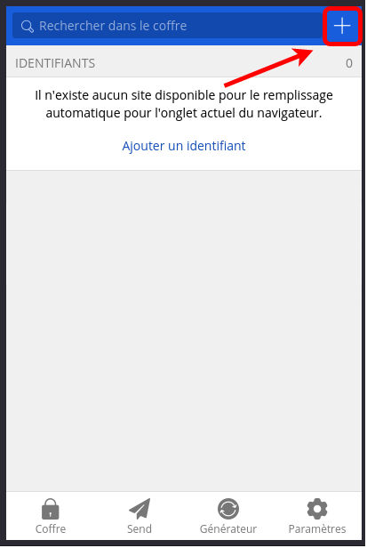

Vous arrivez là-dessus :

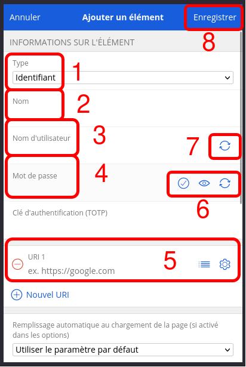

1. Choisissez le type (identifiants, carte bancaire, carte d'identité ou note sécurisée). Vous laissez **"login"** si vous souhaitez ajouter des identifiants de connexion.
2. Le nom de votre identifiant (exemple : "`Pôle Emploi`" ou  "`Google compte du boulot`"), c'est juste le titre. Mettez ce qui vous parle le plus (par défaut Bitwarden met le nom domaine, comme "`accounts.google.com`" par exemple).
3. Votre mail/pseudo (ça dépend des sites)
4. Votre mot de passe
5. Ici vous mettez l'URL, au format `https://account.proton.me` par exemple. C'est ce qui permettra de savoir si vous avez des identifiants correspondant aux sites web que vous visitez.
*Vous pouvez également cliquer sur les 3 petites barres à droite, cela ouvrira un menu déroulant qui vous proposera les URL de vos onglets actuellement ouverts.*

> Vous pouvez voir, comme montré sur la petite image ci-dessus, que je suis actuellement sur un site web, et Bitwarden a reconnu grâce à l'URL `https://account.proton.me` que j'avais un identifiant correspondant. Si vous avez `2` affiché au lieu de `1`, c'est que vous avez deux comptes sur ce site. Au-delà de l'aspect pratique de la chose, elle a aussi un aspect de sécurité, car si vous naviguez sur un site bidon comme `https://account.google.com` (la vrai page de connexion de Google comporte un `s` à la fin de `account`), Bitwarden ne reconnaîtra pas la page et donc n'affichera pas de numéro, ça évite de mettre vos mots de passe sur des sites non-légitimes. Ou alors, vous avez tout simplement oublié d'ajouter l'URL.

6. - Le **bouton de gauche** permet de vérifier qu'il n'y ait pas eu de fuite de ce mot de passe. *Exemple : Facebook se fait pirater, les mots de passe sont dans la nature, Bitwarden permet de vérifier si ce mot de passe fait partie des données qui ont fuitées.*
	- Le bouton du milieu permet de voir votre mot de passe.
	- Le bouton de droite permet de générer ou de régénérer un mot de passe.
7. Ce bouton permet de générer un nom d'utilisateur ! Très utile, car une bonne pratique sur Internet est de ne pas utiliser les mêmes pseudos ! Ça permet de ne pas être identifié facilement.
8. N'oubliez pas de cliquer sur ce bouton ! C'est pour ***enregistrer*** !

## Installer l'application sur votre smartphone

Cherchez "**Bitwarden**" sur le Play Store pour Android ou sur l'AppStore pour IOS. Installez-le et connectez-vous.

L'application Bitwarden se verrouille automatiquement au bout de 15 minutes (vous pouvez le changer dans les paramètres, mais je vous conseille de le laisser par défaut).

Vous avez 4 onglets en bas de l'application. Cliquez sur ***Paramètres*** puis cliquez sur ***Services de remplissage automatique***, activez ***Services de remplissage automatique*** (ça vous enverra dans les paramètres de votre téléphone, et vous devrez manuellement accepter le **service de saisie automatique** pour Bitwarden) et ***Utilisez le remplissage automatique***.

Pour vous connecter plus facilement à l'application, je vous suggère d'activer "**Déverrouiller avec une empreinte digitale**" ou "**Déverrouiller avec un code PIN**"

> Si vous choisissez le code pin, il vous affichera une fenêtre ou vous devez dire "oui" ou "non", cliquez ***"non"***, car si l'application est redémarrée, vous allez devoir remettre votre ***"mot de passe maître"***.

## Le générateur de mots de passe

Le générateur de mot de passe est très puissant et vous permet de générer des pseudos, des mots de passe et des phrases de passe.

1. Le **premier** bouton permet de copier le mot de passe, le **deuxième** permet d'en régénérer un nouveau.
2. Choisissez si vous voulez générer un mot de passe ou un nom d'utilisateur.
3. Choisissez si vous voulez générer un mot de passe ou une phrase de passe.
4. Options supplémentaires, je vous conseille de mettre le **nombre de mots à 6** pour la **phrase de passe**. Pour le séparateur de mots, vous pouvez mettre ce que vous voulez (par défaut ça doit être un `-`, cliquez dessus et effacez-le si vous souhaitez mettre un espace comme dans l'exemple), vous pouvez également mettre la première lettre de chaque mot en majuscule si vous le souhaitez.
5. C'est l'historique des mots de passe que vous avez générés, ils sont effacés à chaque fois que vous fermez votre navigateur web.

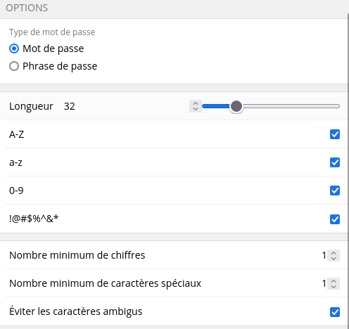

Dans le cas où vous avez choisi de générer un **mot de passe** au lieu d'une phrase de passe. Je vous conseille d'activer tous les boutons comme montré ci-dessus. Pour la longueur, choisissez une vingtaine de caractères minimum, voire plus si vous le souhaitez.

## Utilisation

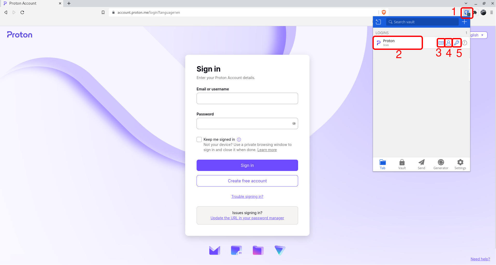

Quand vous visitez un site web comme Proton Mail par exemple, voici les étapes à suivre :

1. ***Cliquez sur l'icône de Bitwarden***. L'icône vous affichera un numéro pour vous signifier que vous avez un compte (ou plusieurs) qui correspond à l'URL donné.
2. ***Cliquez sur la zone où il y a marqué le nom de l'élément*** (ici, "**Proton**"). Cela aura pour effet de remplir automatiquement les champs de texte ! C'est super pratique ! Cependant le remplissage automatique sur certains sites web ne fonctionnera pas pour des raisons obscures. Dans ce cas, vous allez devoir copier votre nom d'utilisateur et votre mot de passe grâce aux boutons.
3. Ce bouton permet d'afficher en détail les identifiants que vous avez entré lors de leurs créations (vous pourrez également les modifier, si vous le souhaitez, en cliquant sur **modifier** qui s'affichera en **haut à droite**).
4. Si vous cliquez sur le **petit bonhomme**, cela aura pour effet de copier le **nom d'utilisateur**, et vous pourrez le coller dans le champ de texte correspondant.
5. Si vous cliquez sur la **petite clé**, cela aura pour effet de copier le **mot de passe**, et vous pourrez le coller dans le champ de texte correspondant.

## Les bonnes pratiques

1. Si vous êtes sur un appareil qui n'est pas le vôtre, je vous conseille très fortement d'ouvrir un ***nouvel onglet en navigation privée*** ! Cela permettra de tout déconnecter une fois que vous aurez fermer la fenêtre ! De plus je vous conseille de paramétrer le délai d'expiration de l'interface web à ***1 minute*** et cocher la case "***Déconnexion***" ! Normalement vous aurez assez de temps pour copier/coller vos identifiants.

> Si c'est trop court pour vous, choisissez "**Personnalisé**" dans le menu déroulant et paramétrez à ***2 minutes***.

2. Utilisez l'interface web uniquement quand vous n'avez ni accès à votre téléphone ni accès à votre PC.
3. Je vous conseille de ne jamais cliquer sur le bandeau qui s'affichera en haut de la page quand vous vous connecterez sur un site web que vous n'avez pas enregistré. *Ce bandeau vous propose d'enregistrer automatiquement vos identifiants. Si vous cliquez sur **Enregistrer**, je vous conseille de vérifier manuellement à chaque fois sur Bitwarden que le nom d'utilisateur et le mot de passe sont bien les bons ! Des erreurs sont parfois commises par Bitwarden !* Ajoutez manuellement vos identifiants à chaque fois, c'est beaucoup plus sûr !

Je vous conseille même de le désactiver via l'extension en allant dans "**Paramètres**" puis faites défiler vers le bas jusqu'à trouver "**Options**" :

Ensuite décochez "**Désactiver la notification d'ajout d'identifiant**" et "**Désactiver la notification de changement de mot de passe**". Pensez-bien à remodifier le mot de passe dans Bitwarden si vous en avez changer un.

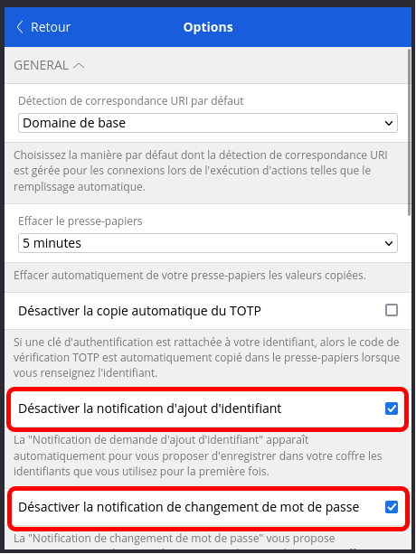

4. Si vous souhaitez créer rapidement un compte sur un site web où vous allez rester juste 5 minutes dessus, **NE METTEZ PAS** pas votre "mot de passe standard" (celui que vous utilisez pour tous vos comptes). Parce que si vous n'utilisez plus jamais ce compte, et qu'un jour, ce site web a des fuites de données, votre "mot de passe standard" sera fuité lui aussi et compromettra tous les comptes que vous n'aviez pas encore changé ! Entrez un **mot de passe aléatoire** généré par Bitwarden, et si un jour ce site web a des fuites, vous êtes tranquille !

***N'utilisez plus votre mot de passe standard sur Internet !***

5. Ne partagez ***sous aucun prétexte*** votre **`mot de passe maître`**.
